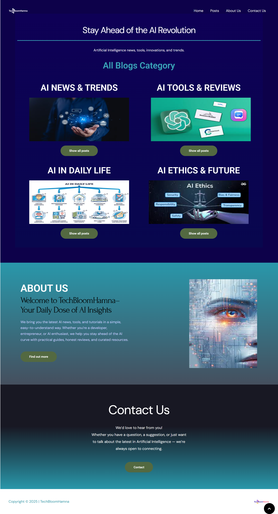
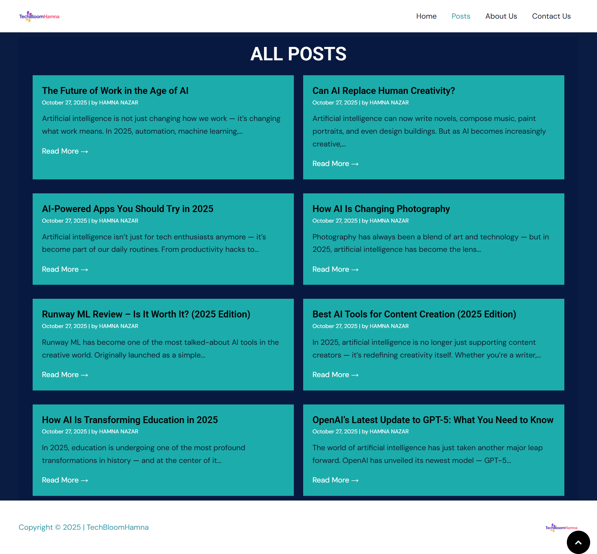
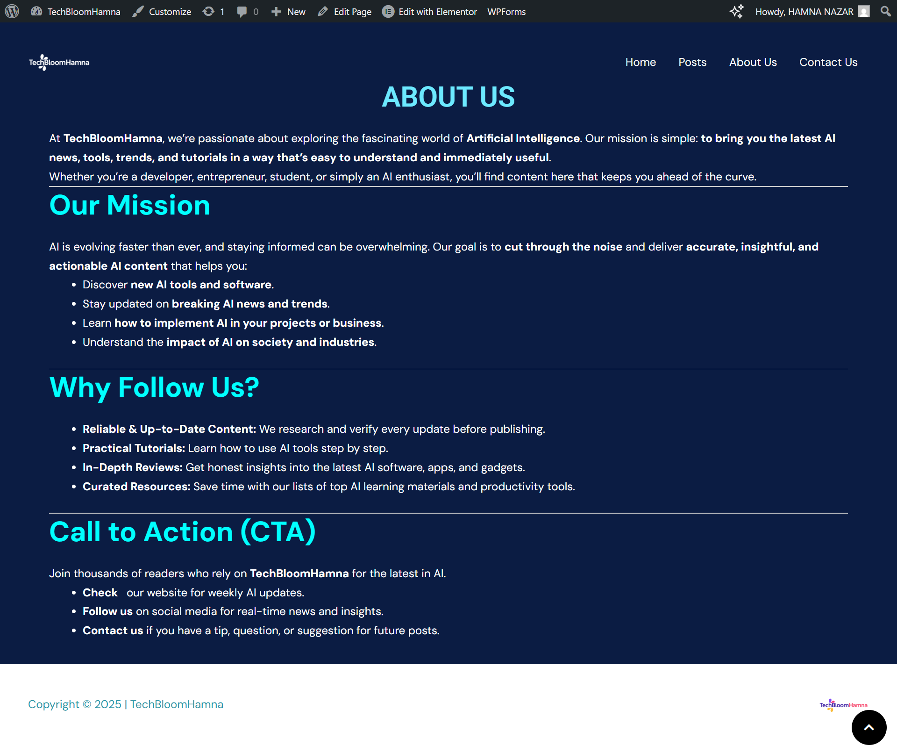
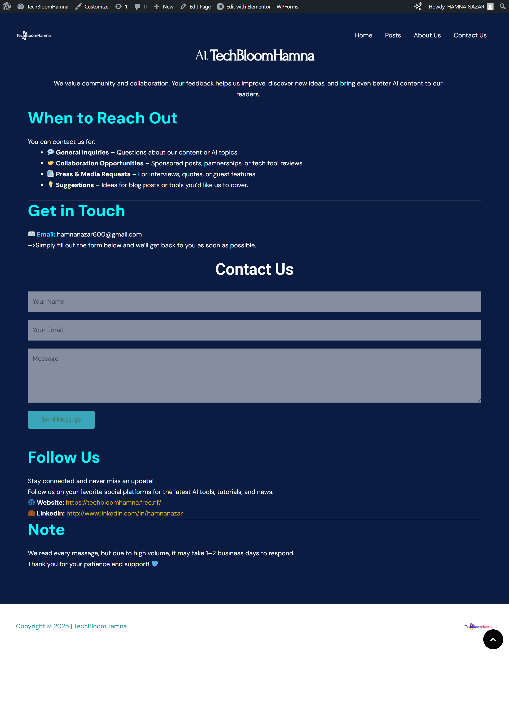

# 🤖 TechBloomHamna

**Live Site:** [https://techbloomhamna.free.nf/](https://techbloomhamna.free.nf/)  
**Created by:** [Hamna Nazar](https://www.linkedin.com/in/hamnanazar)  

> *“Your Daily Dose of AI Insights”*

TechBloomHamna is a modern AI-focused blog built with **WordPress** and **Elementor**, offering daily insights, tutorials, and reviews about Artificial Intelligence.  
It’s designed to make complex AI concepts simple, engaging, and accessible to everyone — from students to professionals.

---

## 🌐 Overview

- **Platform:** WordPress  
- **Hosting:** Free.nf (InfinityFree)  
- **Purpose:** Share AI news, tools, and tech trends  
- **Launch Year:** 2025  
- **Author:** Hamna Nazar  

---

## 🧭 Mission

To deliver **accurate, easy-to-understand, and actionable content** on Artificial Intelligence, empowering readers to stay informed about the ever-evolving world of AI.

---

## 📰 Blog Categories

- **AI News & Trends** — The latest developments and innovations  
- **AI Tools & Reviews** — Hands-on reviews of top AI apps  
- **AI in Daily Life** — How AI impacts society, art, and education  
- **AI Ethics & Future** — Exploring moral and technological implications  

---

## 📝 Featured Articles

| Title | Summary |
|-------|----------|
| The Future of Work in the Age of AI | How AI is redefining work and jobs in 2025 |
| Can AI Replace Human Creativity? | Exploring AI’s role in art, writing, and design |
| AI-Powered Apps You Should Try in 2025 | Review of trending AI tools |
| How AI Is Changing Photography | The rise of generative visuals |
| Runway ML Review – Is It Worth It? | Honest breakdown of Runway ML |
| Best AI Tools for Content Creation (2025) | Tools for writers, designers, and creators |
| How AI Is Transforming Education in 2025 | AI as a classroom assistant |
| OpenAI’s Latest Update to GPT-5 | Everything about the new model |

> All articles authored by **Hamna Nazar**.

---

## 💡 Design & Features

- Built using **Elementor Page Builder**  
- Custom logo: “TechBloomHamna” with colorful bloom icon  
- Clean and mobile-friendly design  
- Contact form (via WPForms)  
- Responsive dark blue/teal theme  
- Footer: © 2025 TechBloomHamna  

---
## 📸 Screenshots

> Visual tour of **TechBloomHamna** 

### 1. **Home Page**  
*Clean, modern landing with category previews and CTA*

  
*`home.png`*

---

### 2. **All Posts / Blog Section**  
*Grid layout of latest AI articles*

  
*`blogs.png`*

---

### 3. **About Us**  
*Mission, vision, and value proposition*

  
*`about-us.png`*

---

### 4. **Contact Us**  
*Contact form, email, LinkedIn, and collaboration options*

  
*`contact-us.png`*

---

## 📬 Contact

- **Email:** [hamnanazar600@gmail.com](mailto:hamnanazar600@gmail.com)  
- **LinkedIn:** [linkedin.com/in/hamnanazar](https://www.linkedin.com/in/hamnanazar)  
- **Response Time:** 1–2 business days  

Open to:
- General inquiries  
- Collaboration & sponsored reviews  
- Press/media requests  
- Blog topic suggestions  

---

## 🚀 Future Goals

1. Move to a custom domain (e.g. `techbloomhamna.com`)  
2. Publish unique, human-written blog posts  
3. Integrate social media links  
4. Enable blog comments and user interaction  
5. Submit to **Google Search Console** for indexing  

---

## 🧠 Technologies Used

- **WordPress CMS**  
- **Elementor Builder**  
- **WPForms** (Contact form)  
- **HTML, CSS, JavaScript** (theme customization)  
- **Free.nf hosting**  

---

## 🪄 License

This project is intended for **educational and portfolio purposes**.  

---

© 2025 TechBloomHamna | Designed & Managed by **Hamna Nazar**
